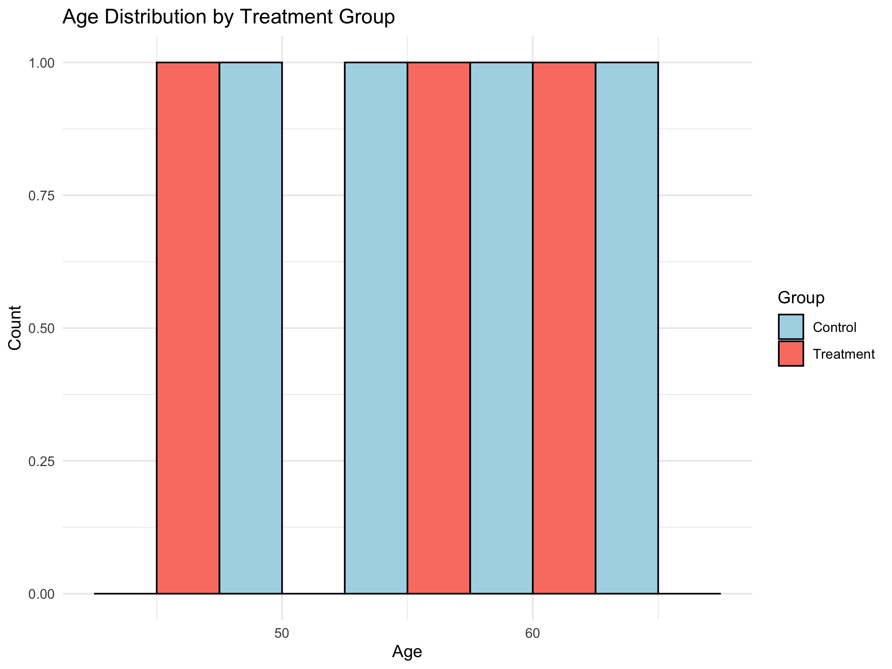

```{r setup, include=FALSE}
knitr::opts_chunk$set(echo = FALSE, message = FALSE, warning = FALSE)
# Load necessary libraries for the report
library(knitr)
library(dplyr)
library(kableExtra)
library(tidyr)
```

## Introduction
This report summarizes the initial findings from the randomized controlled trial of Drug XYZ. The data pipeline for this report uses a combination of Python, SAS, and R to ensure a reproducible and robust analysis.

## Participant Enrollment and Characteristics
The following data was acquired and cleaned using a Python script and analyzed using SAS.

``` {r analysis_summary, echo=FALSE, results='asis'}
# Load the analysis results from the SAS script
analysis_results <- read.csv("analysis_results.csv")

# Create a data frame for sex summary from the first 4 rows
sex_summary <- analysis_results %>%
  dplyr::filter(!is.na(Sex)) %>%
  tidyr::pivot_wider(
    names_from = Treatment,
    values_from = c(Freq, Percent)
  )

# Create a data frame for age summary from the last 2 rows
age_summary <- analysis_results %>%
  dplyr::filter(!is.na(Age_Mean)) %>%
  # Convert Age_Mean and Age_StdDev to numeric
  dplyr::mutate(
    Age_Mean = as.numeric(Age_Mean),
    Age_StdDev = as.numeric(Age_StdDev)
  ) %>%
  tidyr::pivot_wider(
    names_from = Treatment,
    values_from = c(Age_Mean, Age_StdDev)
  )

# Combine the data for the final table
final_table <- data.frame(
  Variable = c("Sex", "Male", "Female", "Age (Mean ± SD)"),
  `Control Group` = c(NA,
                      paste0(sex_summary$Freq_0[2], " (", sex_summary$Percent_0[2], "%)"),
                      paste0(sex_summary$Freq_0[1], " (", sex_summary$Percent_0[1], "%)"),
                      paste0(round(age_summary$Age_Mean_0[1], 2), " (", round(age_summary$Age_StdDev_0[1], 2), ")")),
  `Treatment Group` = c(NA,
                        paste0(sex_summary$Freq_1[2], " (", sex_summary$Percent_1[2], "%)"),
                        paste0(sex_summary$Freq_1[1], " (", sex_summary$Percent_1[1], "%)"),
                        paste0(round(age_summary$Age_Mean_1[1], 2), " (", round(age_summary$Age_StdDev_1[1], 2), ")"))
)

# Print the table using kable
knitr::kable(final_table, format = "html") %>%
  kable_styling(bootstrap_options = c("striped", "hover", "condensed", "responsive"))
### 

#print(knitr::kable(final_table, format = "html") %>% kable_styling(bootstrap_options = c("striped", "hover", "condensed", "responsive")))

# Display the plot generated by the R script



```

